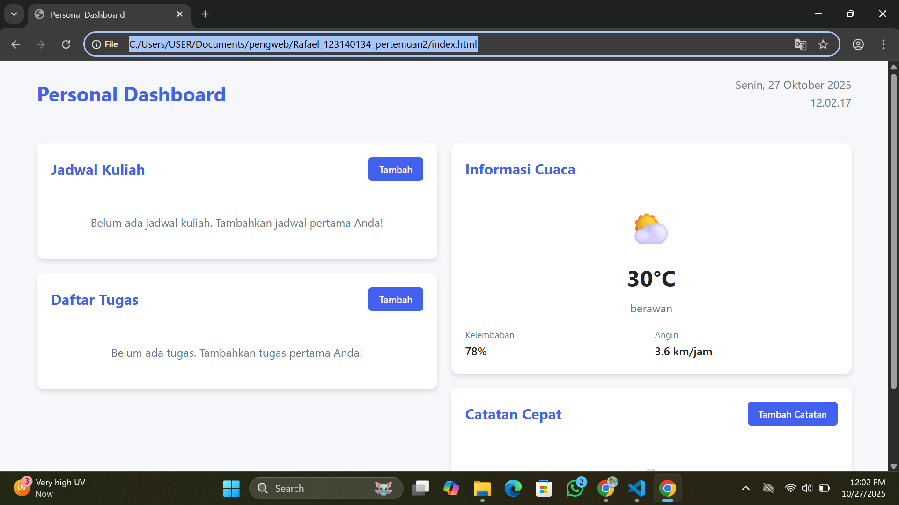
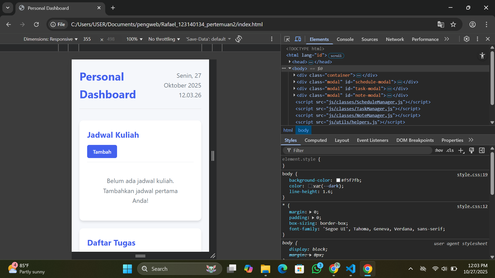
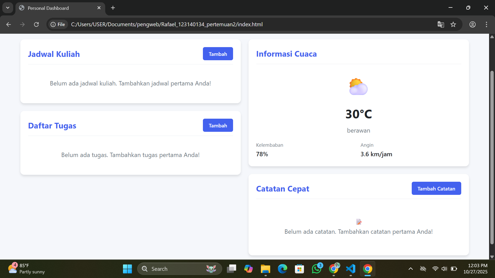

# Personal Dashboard - Dokumentasi

## Deskripsi Aplikasi

Personal Dashboard adalah aplikasi web sederhana yang membantu pengguna mengelola jadwal kuliah, daftar tugas, dan catatan penting. Aplikasi ini dirancang dengan antarmuka yang user-friendly dan menyimpan semua data secara lokal di browser pengguna.

## Fitur Utama

### Manajemen Jadwal Kuliah
- **Tambah Jadwal**: Input mata kuliah, hari, waktu, dan lokasi
- **Edit Jadwal**: Modifikasi jadwal yang sudah ada
- **Hapus Jadwal**: Hapus jadwal yang tidak diperlukan
- **Sortir Otomatis**: Jadwal diurutkan berdasarkan hari dan waktu

### Manajemen Tugas
- **Buat Tugas**: Input nama tugas, deskripsi, deadline, dan prioritas
- **Prioritas Tugas**: Kategori prioritas (Tinggi, Sedang, Rendah) dengan warna berbeda
- **Deadline Tracking**: Tampilan deadline yang jelas
- **Edit & Hapus**: Kelola tugas yang sudah dibuat

### Catatan Cepat
- **Buat Catatan**: Input judul dan isi catatan
- **Timestamps**: Catatan waktu pembuatan dan edit
- **Organisasi**: Tampilan kartu yang rapi
- **CRUD Lengkap**: Create, Read, Update, Delete catatan

### Informasi Cuaca (Demo)
- **Tampilan Cuaca**: Informasi suhu dan kondisi cuaca
- **Data Demo**: Menggunakan data statis untuk demonstrasi
- **Desain Responsif**: Tampilan cuaca yang informatif

### Fitur Tambahan
- **Waktu Real-time**: Tanggal dan waktu terkini
- **Penyimpanan Lokal**: Data tersimpan di browser (localStorage)
- **Responsive Design**: Tampilan optimal di desktop dan mobile
- **Notifikasi Sistem**: Feedback untuk setiap aksi

## Screenshot Aplikasi

### Tampilan Desktop


### Tampilan Mobile  


### Fitur Utama


## Fitur ES6+ yang Diimplementasikan

### 1. **Classes**
```javascript
class ScheduleManager {
    constructor() {
        this.schedules = this.loadSchedules();
    }
    
    addSchedule = (schedule) => {
        // Implementasi
    }
}
```

### 2. **Arrow Functions**
```javascript
// Arrow function untuk method class
loadSchedules = () => {
    const stored = localStorage.getItem('schedules');
    return stored ? JSON.parse(stored) : [];
}

// Arrow function untuk event handlers
const renderSchedules = () => {
    // Implementasi rendering
}
```

### 3. **Template Literals**
```javascript
// Dynamic HTML rendering
domElements.scheduleList.innerHTML = schedules.map(schedule => `
    <div class="schedule-item">
        <strong>${schedule.name}</strong>
        <div class="schedule-time">${schedule.day}, ${formatTime(schedule.time)}</div>
    </div>
`).join('');
```

### 4. **Async/Await**
```javascript
// Fungsi asynchronous untuk data cuaca
const fetchWeatherData = async () => {
    try {
        await new Promise(resolve => setTimeout(resolve, 1000));
        const weatherData = await getDummyWeatherData();
        displayWeatherData(weatherData);
    } catch (error) {
        console.error('Error:', error);
    }
}
```

### 5. **let dan const**
```javascript
// Penggunaan const untuk nilai tetap
const scheduleManager = new ScheduleManager();
const DOM_ELEMENTS = {
    scheduleList: document.getElementById('schedule-list'),
    // ...
};

// Penggunaan let untuk variabel yang bisa berubah
let currentWeatherData = null;
```

### 6. **Destructuring Assignment**
```javascript
// Destructuring object
const { scheduleList, taskList, notesList } = domElements;

// Destructuring parameters
const updateSchedule = (id, { name, day, time, location }) => {
    // Implementasi
}
```

### 7. **Spread Operator**
```javascript
// Copy array
getAllSchedules = () => {
    return [...this.schedules];
}

// Merge objects
updateSchedule = (id, updatedSchedule) => {
    this.schedules[index] = {...this.schedules[index], ...updatedSchedule};
}
```

### 8. **Enhanced Object Literals**
```javascript
const noteManager = {
    // Property shorthand
    notes,
    
    // Method shorthand
    addNote(note) {
        // Implementasi
    },
    
    // Computed property names
    [`get${type}Notes`]() {
        // Implementasi
    }
}
```

### 9. **Default Parameters**
```javascript
const truncateText = (text, maxLength = 100) => {
    if (text.length <= maxLength) return text;
    return text.substr(0, maxLength) + '...';
}
```

### 10. **Modules Structure**
```javascript
// Organisasi kode dalam module terpisah
// - js/classes/ScheduleManager.js
// - js/classes/TaskManager.js  
// - js/classes/NoteManager.js
// - js/utils/helpers.js
// - js/app.js
```

## Teknologi yang Digunakan

- **HTML5** - Struktur aplikasi
- **CSS3** - Styling dan layout (Grid, Flexbox, Variables)
- **Vanilla JavaScript ES6+** - Logika aplikasi
- **LocalStorage API** - Penyimpanan data
- **Responsive Design** - Kompatibilitas multi-device

## Struktur Project

```
personal-dashboard/
├── index.html
├── css/
│   └── style.css
├── js/
│   ├── app.js
│   ├── classes/
│   │   ├── ScheduleManager.js
│   │   ├── TaskManager.js
│   │   └── NoteManager.js
│   └── utils/
│       └── helpers.js
└── README.md
```

## Cara Menjalankan

1. **Download semua file** ke dalam satu folder
2. **Buka file `index.html`** di browser web
3. **Aplikasi siap digunakan** - tidak memerlukan instalasi tambahan

## Penyimpanan Data

Semua data disimpan secara lokal di browser menggunakan **localStorage**:
- `schedules` - Data jadwal kuliah
- `tasks` - Data daftar tugas  
- `quickNotes` - Data catatan cepat

Data akan tetap tersimpan meskipun browser ditutup dan dapat diakses kapan saja.

## Tujuan Pembelajaran

Aplikasi ini dibuat untuk mendemonstrasikan:
- Penerapan konsep ES6+ dalam project nyata
- Manajemen state dengan JavaScript vanilla
- Manipulasi DOM secara dinamis
- Penyimpanan data lokal di browser
- Pembuatan antarmuka pengguna yang responsif
- Organisasi kode yang terstruktur dan modular

---
