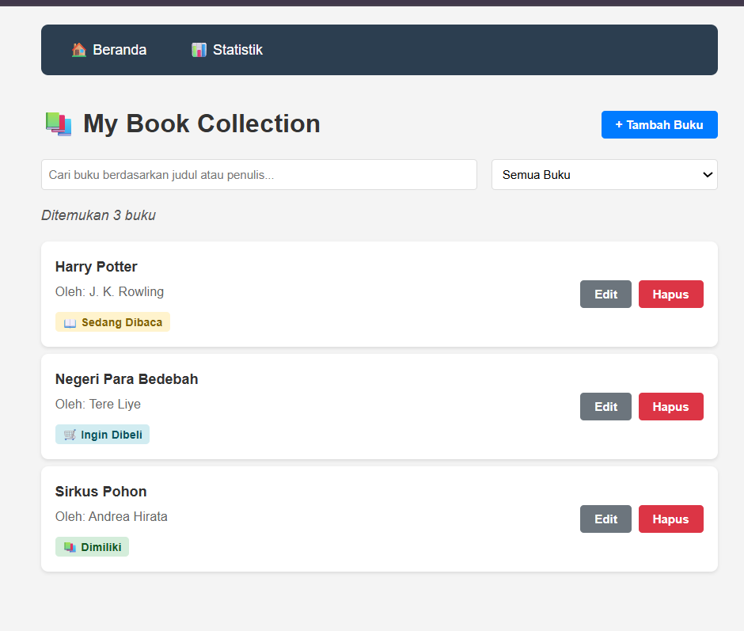
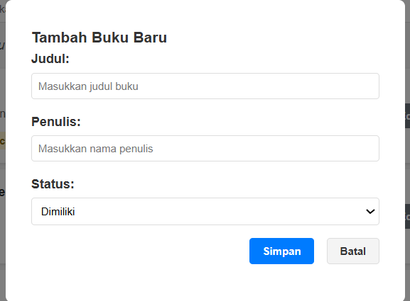
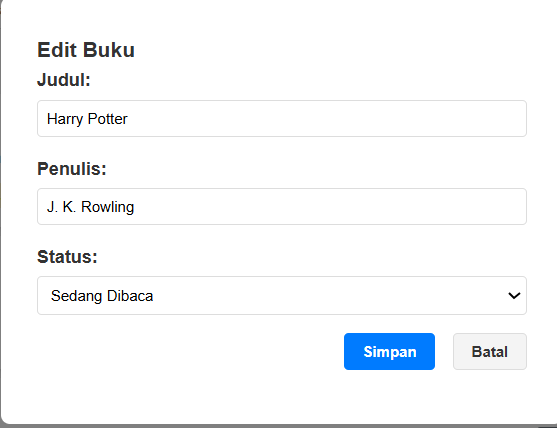
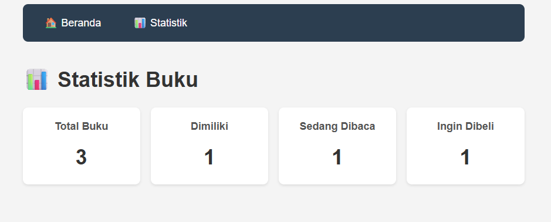
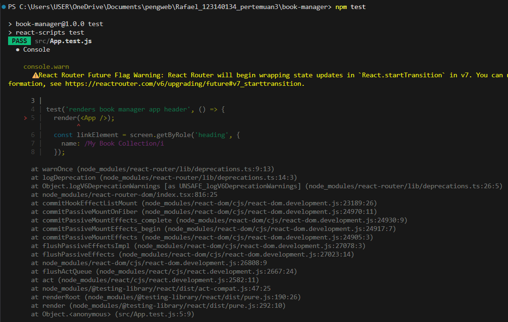

# Pertemuan 3: Aplikasi Manajemen Buku Pribadi (React)

---

**Nama:** Rafael Abimanyu Ratmoko
**NIM:** 123140134

---

## 1. 📖 Deskripsi Aplikasi

Aplikasi **Book Manager** ini adalah *Single Page Application* (SPA) yang dibuat menggunakan React sebagai pemenuhan Tugas Praktikum Pertemuan 3.

Aplikasi ini berfungsi sebagai pelacak koleksi buku pribadi. Data buku yang dimasukkan akan tersimpan di dalam `localStorage` browser, sehingga data tidak akan hilang ketika halaman di-refresh.

### Fitur Utama:
* **CRUD:** Menambah, Mengedit, dan Menghapus buku.
* **Pencarian:** Mencari buku secara *real-time* berdasarkan judul atau penulis.
* **Filter:** Memfilter buku berdasarkan status (Semua, Dimiliki, Sedang Dibaca, Ingin Dibeli).
* **Navigasi:** Pindah halaman antara "Beranda" dan "Statistik" menggunakan React Router.
* **Statistik:** Halaman khusus untuk melihat rangkuman total buku.
* **Penyimpanan:** Data persisten menggunakan `localStorage`.

## 2. ⚙️ Instruksi Menjalankan Proyek

Proyek ini dibuat menggunakan `create-react-app`.

1.  **Navigasi ke Folder Proyek**
    Setelah meng-kloning repository ini, masuk ke folder proyek:
    ```bash
    cd pertemuan3
    ```

2.  **Install Dependencies**
    Jalankan perintah ini untuk meng-install semua paket yang dibutuhkan (seperti `react`, `react-router-dom`, dll).
    ```bash
    npm install
    ```

3.  **Menjalankan Aplikasi (Development Mode)**
    Perintah ini akan menjalankan aplikasi di `http://localhost:3000`.
    ```bash
    npm start
    ```

4.  **Menjalankan Unit Test**
    Perintah ini akan menjalankan 6 unit test yang telah disiapkan menggunakan Jest dan React Testing Library.
    ```bash
    npm test
    ```

## 3. 🚀 Teknologi & Konsep React yang Digunakan

* **Functional Components & Hooks:**
    * **`useState`**: Mengelola *local state* seperti data form dan status modal.
    * **`useEffect`**: Sinkronisasi *state* ke `localStorage` dan mengisi data form saat mode edit.
* **React Router (v6):**
    * Mengatur navigasi *client-side* antara halaman `/` (Home) dan `/stats` (Stats).
* **Context API (`BookContext.js`):**
    * Menyediakan *global state management* untuk data buku, filter, dan fungsi CRUD (`addBook`, `editBook`, `deleteBook`) agar bisa diakses oleh semua komponen tanpa *prop-drilling*.
* **Custom Hooks:**
    * **`useLocalStorage.js`**: Hook kustom untuk abstraksi logika simpan-baca ke `localStorage` secara otomatis.
    * **`useBooks.js`**: Hook kustom yang berfungsi sebagai *selector* untuk mengolah data (filter, search, dan statistik) dari Context.
* **React Testing Library (RTL) & Jest:**
    * Implementasi 6 test unit untuk memvalidasi fungsionalitas inti aplikasi, terutama pada `App.js` dan `BookForm.js`.

## 4. 📸 Screenshot

**Halaman Utama (Filter & Daftar Buku)**


**Modal Form (Tambah Buku)**


**Modal Form (Edit Buku)**


**Halaman Statistik**


**Hasil Laporan Test (6 Passed)**
*(Screenshot ini menunjukkan hasil akhir 6 test lolos di terminal)*
(./screenshots/testapp2.png)(./screenshots/testbookform.png)