# Sistem Manajemen Perpustakaan Sederhana

Rafael Abimanyu Ratmoko
123140134

## Deskripsi Program
Sistem manajemen perpustakaan sederhana yang dibangun menggunakan konsep Object-Oriented Programming (OOP) Python. Program ini memungkinkan pengelolaan koleksi buku dan majalah dengan berbagai operasi dasar perpustakaan secara efisien dan terstruktur.

## Fitur Utama
- **Manajemen Item**: Tambah, hapus, dan lihat item perpustakaan
- **Pencarian Lanjutan**: Cari berdasarkan judul atau ID
- **Sistem Peminjaman**: Pinjam dan kembalikan item dengan status real-time
- **Statistik**: Lihat statistik lengkap perpustakaan
- **Kategori Item**: Dukungan buku dan majalah dengan atribut khusus
- **Validasi Data**: Sistem validasi input yang robust

## Struktur Kode & Arsitektur

### File Structure
```
library_management/
├── library_item.py    # Abstract base class
├── items.py          # Concrete classes (Book, Magazine)
├── library.py        # Library management class
└── main.py           # Main program & UI menu

```

### Class Diagram
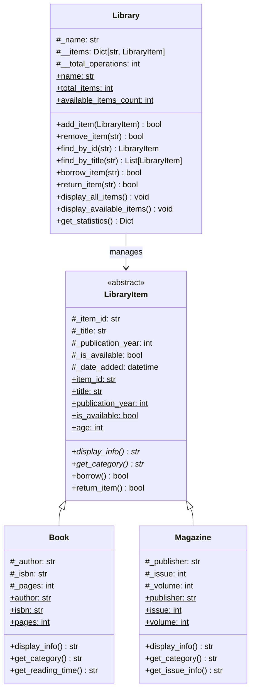

## 🔧 Implementasi Konsep OOP

### 1. Abstract Class & Inheritance (30% Bobot)
```python
# Abstract Base Class
class LibraryItem(ABC):
    @abstractmethod
    def display_info(self) -> str:
        pass

# Inheritance
class Book(LibraryItem):
    def display_info(self) -> str:
        # Implementasi spesifik untuk Book
```

### 2. Encapsulation (25% Bobot)
```python
class LibraryItem:
    def __init__(self):
        self._item_id = ""      # Protected attribute
        self.__internal_data = "" # Private attribute
    
    @property
    def item_id(self) -> str:   # Property getter
        return self._item_id
    
    @property
    def is_available(self) -> bool:
        return self._is_available
    
    @is_available.setter        # Property setter dengan validasi
    def is_available(self, value: bool):
        if isinstance(value, bool):
            self._is_available = value
```

### 3. Polymorphism (20% Bobot)
```python
# Method overriding pada subclass
book = Book(...)
magazine = Magazine(...)

# Polymorphic behavior
print(book.display_info())   # Output spesifik Book
print(magazine.display_info()) # Output spesifik Magazine

# Interface konsisten
items = [book, magazine]
for item in items:
    print(item.get_category())  # Polymorphic method call
```

### 4. Fungsionalitas Program (15% Bobot)
- **CRUD Operations**: Add, remove, view items
- **Search System**: By title and ID
- **Borrowing System**: Loan and return with status tracking
- **Statistics**: Comprehensive library analytics
- **Data Validation**: Input validation and error handling

### 5. Dokumentasi Kode (10% Bobot)
```python
class Library:
    """
    Class Library untuk mengelola koleksi item perpustakaan.
    Mengimplementasikan encapsulation dengan private attributes.
    
    Attributes:
        _name (str): Nama perpustakaan (protected)
        __items (Dict): Koleksi item (private)
        __total_operations (int): Counter operasi (private)
    """
```

## Panduan Instalasi & Menjalankan

### Prerequisites
- Python 3.6 atau lebih tinggi
- Tidak memerlukan library external

### Langkah-langkah
1. **Clone atau download** semua file ke folder yang sama
2. **Buka terminal/command prompt** di folder tersebut
3. **Jalankan program**:
   ```bash
   python main.py
   ```
4. **Ikuti menu interaktif** yang muncul

### Contoh Penggunaan
```bash
$ python main.py
SISTEM MANAJEMEN PERPUSTAKAAN
Selamat datang di Perpustakaan Teknik Informatika!

MENU UTAMA
==================================================
1. Tampilkan semua item
2. Tampilkan item tersedia
3. Cari item berdasarkan judul
4. Cari item berdasarkan ID
5. Pinjam item
6. Kembalikan item
7. Tambah item baru
8. Hapus item
9. Lihat statistik
10. Lihat detail item
0. Keluar
==================================================
Pilih menu (0-10): 1
```

## Screenshot Output
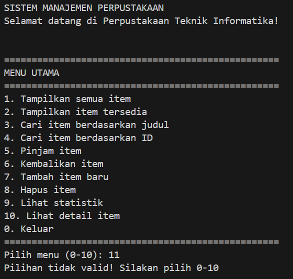
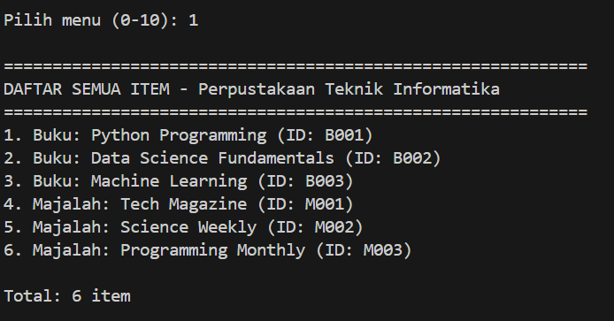
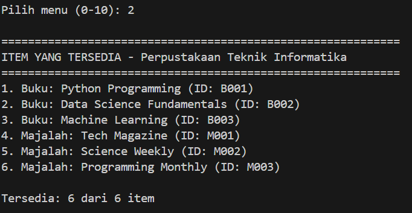
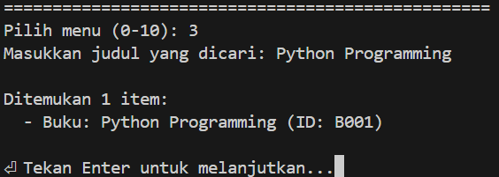
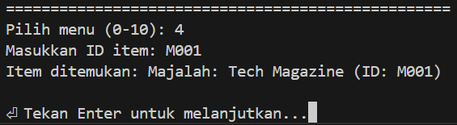
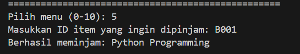
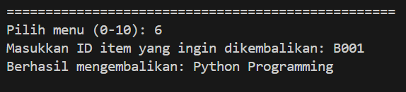
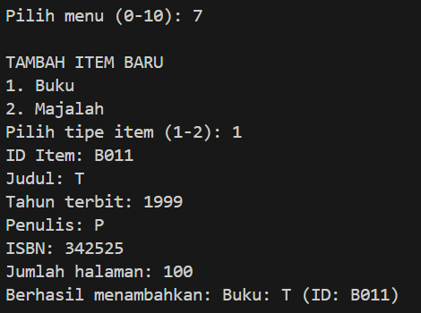
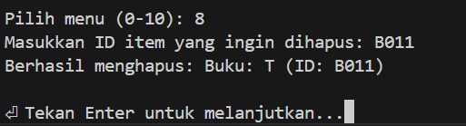
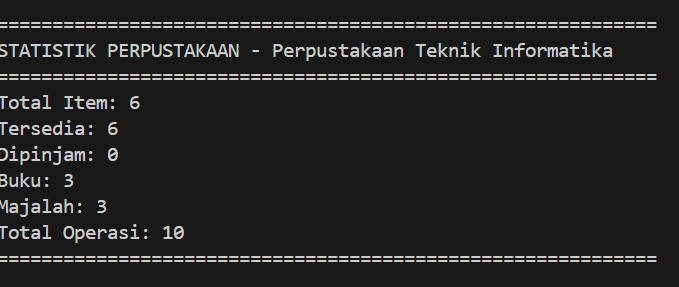
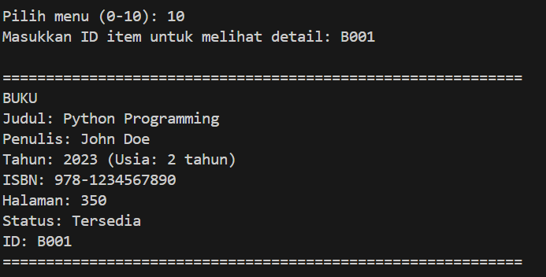


### Contoh Tampilan Menu
```
DAFTAR SEMUA ITEM - Perpustakaan Teknik Informatika
==================================================
1. Buku: Python Programming (ID: B001)
2. Buku: Data Science Fundamentals (ID: B002)
3. Majalah: Tech Magazine (ID: M001)

Total: 3 item
```

### Contoh Detail Item
```
==================================================
BUKU
Judul: Python Programming
Penulis: John Doe
Tahun: 2023 (Usia: 1 tahun)
ISBN: 978-1234567890
Halaman: 350
Status: Tersedia
ID: B001
==================================================
```

### Contoh Statistik
```
==================================================
STATISTIK PERPUSTAKAAN - Perpustakaan Teknik Informatika
==================================================
Total Item: 5
Tersedia: 3
Dipinjam: 2
Buku: 3
Majalah: 2
Total Operasi: 15
==================================================
```

## Use Cases

### 1. Menambah Buku Baru
```
Pilih menu: 7
TAMBAH ITEM BARU
1. Buku
2. Majalah
Pilih tipe item (1-2): 1
ID Item: B004
Judul: Artificial Intelligence Basics
Tahun terbit: 2024
Penulis: Dr. Michael Chen
ISBN: 978-5555666777
Jumlah halaman: 420
Berhasil menambahkan: Buku: Artificial Intelligence Basics (ID: B004)
```

### 2. Meminjam Item
```
Pilih menu: 5
Masukkan ID item yang ingin dipinjam: B001
Berhasil meminjam: Python Programming
```

### 3. Mencari Item
```
Pilih menu: 3
Masukkan judul yang dicari: python
Ditemukan 1 item:
  - Buku: Python Programming (ID: B001)
```

## Teknikal Details

### Design Patterns Used
1. **Template Method Pattern**: Melalui abstract methods
2. **Composition Pattern**: Library composed of LibraryItems
3. **Getter/Setter Pattern**: Melalui property decorators

### Data Persistence
- Data disimpan dalam memory selama program berjalan
- Dapat dikembangkan dengan database untuk persistence

### Error Handling
- Input validation untuk semua user inputs
- Exception handling untuk operasi file
- Graceful error messages

```

## Detailed Class Diagram

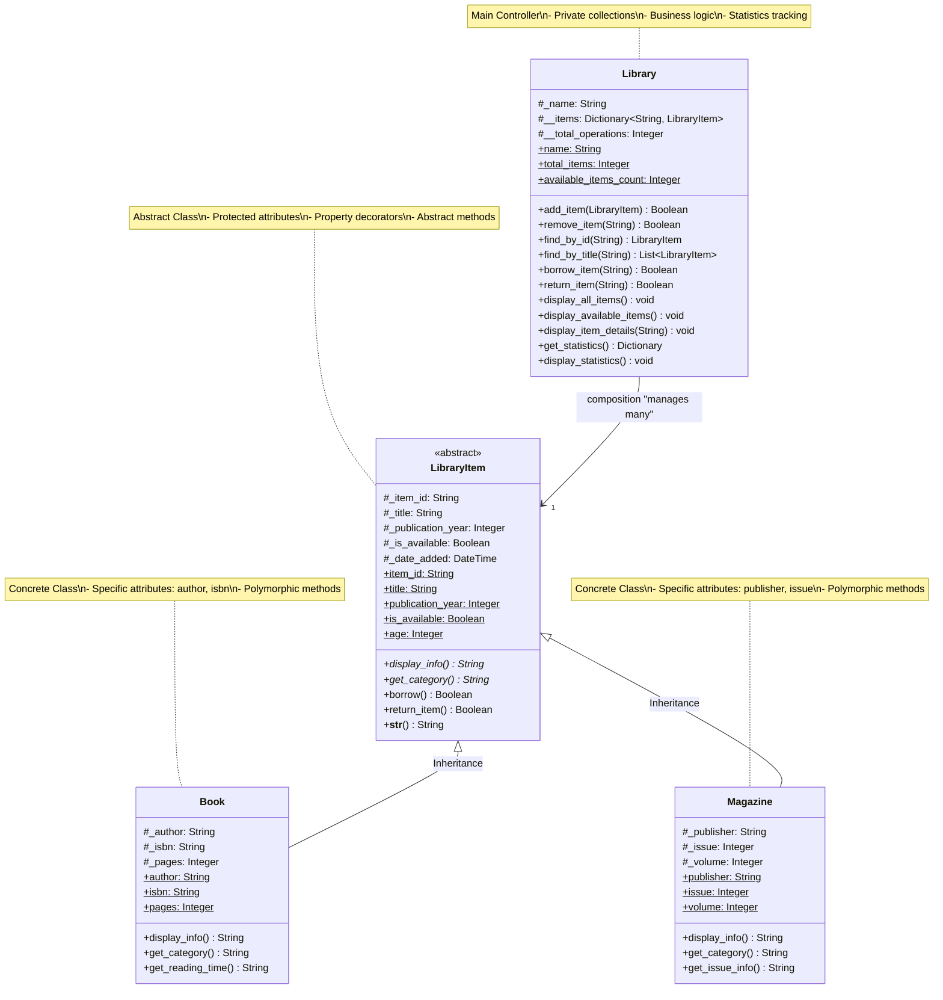