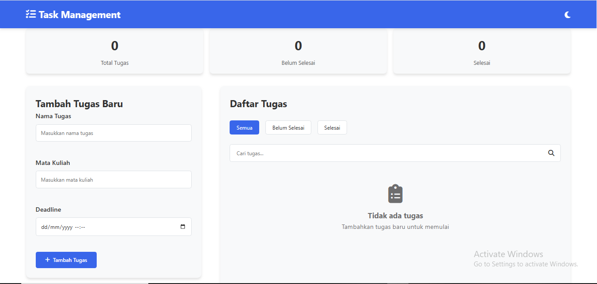
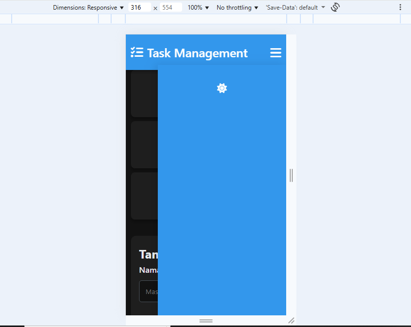

# Task Management - Aplikasi Manajemen Tugas Mahasiswa

## 📋 Deskripsi Aplikasi

**Task Management** adalah aplikasi web yang dirancang khusus untuk membantu mahasiswa dalam mengelola dan mengorganisir tugas-tugas akademik mereka. Aplikasi ini menyediakan antarmuka yang intuitif dan responsif untuk mencatat, melacak, dan mengelola deadline tugas kuliah.

Dibuat oleh: **Rafael Abimanyu Ratmoko**  
NIM: **123140134**  
Mata Kuliah: **Pemrograman Web - Pertemuan 1**

## 🖼️ Screenshot Aplikasi

### 1. Tampilan Utama - Light Mode

*Antarmuka utama aplikasi dengan form input tugas baru, statistik, dan daftar tugas yang terorganisir*

### 2. Tampilan Dark Mode dengan Filter

*Tampilan dark mode yang nyaman di mata dengan filter tugas yang aktif dan pencarian*

### 3. Tampilan Mobile Responsif

*Tampilan optimal di perangkat mobile dengan hamburger menu dan layout yang dioptimalkan*

## 🚀 Cara Menjalankan Aplikasi

### Persyaratan Sistem:
- Browser web modern (Chrome, Firefox, Safari, Edge)
- JavaScript diaktifkan
- Tidak memerlukan koneksi internet (setelah di-load)

### Langkah-langkah:
1. **Download semua file** project ke dalam satu folder
2. **Buka file `index.html`** di browser web dengan cara:
   - Double-click file `index.html`, atau
   - Drag file ke jendela browser, atau
   - Buka browser → File → Open → Pilih `index.html`

3. **Aplikasi siap digunakan** - Data akan tersimpan secara otomatis di browser Anda

### Browser yang Didukung:
- ✅ Google Chrome (versi 60+)
- ✅ Mozilla Firefox (versi 55+)
- ✅ Safari (versi 12+)
- ✅ Microsoft Edge (versi 79+)

## ✅ Fitur yang Telah Diimplementasikan

### 🎯 Fitur Utama (CRUD Operations)
- **➕ Tambah Tugas Baru** - Input tugas dengan nama, mata kuliah, dan deadline
- **👁️ Lihat Daftar Tugas** - Tampilan semua tugas dengan informasi lengkap
- **✏️ Edit Tugas** - Ubah detail tugas yang sudah ada
- **🗑️ Hapus Tugas** - Hapus tugas yang tidak diperlukan dengan konfirmasi
- **✅ Tandai Selesai/Belum Selesai** - Toggle status penyelesaian tugas

### 🔍 Fitur Pencarian dan Filter
- **🔎 Pencarian Real-time** - Cari tugas berdasarkan nama atau mata kuliah
- **📊 Filter Status** - Filter berdasarkan: Semua tugas, Belum selesai, Sudah selesai
- **📈 Statistik Real-time** - Menampilkan jumlah total, pending, dan completed tasks

### 🎨 Fitur User Experience
- **🌙 Dark/Light Mode** - Toggle tema gelap/terang dengan preferensi tersimpan
- **📱 Responsif Design** - Optimal di desktop, tablet, dan smartphone
- **🍔 Hamburger Menu** - Navigasi mobile-friendly
- **⚡ Animasi Halus** - Transisi dan feedback visual yang smooth
- **🎯 Toast Notifications** - Notifikasi untuk setiap aksi yang dilakukan

### 💾 Fitur Data Management
- **💾 Auto-save** - Data tersimpan otomatis ke localStorage
- **🛡️ Data Validation** - Validasi input form yang komprehensif
- **📤 Backup Data** - Struktur data yang konsisten dan reliable

## 🔧 Penjelasan Teknis

### 📚 Implementasi LocalStorage

#### Penyimpanan Data:
```javascript
{
  "tasks": [
    {
      "id": "1704967890123",
      "name": "Tugas Kalkulus Differential",
      "course": "Matematika Lanjut",
      "deadline": "2024-01-20T14:30",
      "completed": false,
      "createdAt": "2024-01-10T10:00:00.000Z"
    }
  ],
  "darkMode": "enabled"
}
```

#### Fungsi Penyimpanan:
```javascript
function saveTasks(tasks) {
    try {
        localStorage.setItem('tasks', JSON.stringify(tasks));
        console.log('✅ Tasks saved successfully');
        return true;
    } catch (error) {
        console.error('❌ Error saving tasks:', error);
        return false;
    }
}

function loadTasks() {
    try {
        const tasksJSON = localStorage.getItem('tasks');
        return tasksJSON ? JSON.parse(tasksJSON) : [];
    } catch (error) {
        console.error('❌ Error loading tasks:', error);
        return [];
    }
}
```

#### Keunggulan Implementasi:
1. **Error Handling** - Menangani error localStorage dengan graceful degradation
2. **Data Validation** - Validasi data sebelum disimpan
3. **Auto-recovery** - Default ke array kosong jika data corrupt
4. **Persistensi** - Data tetap ada setelah browser ditutup

### ✅ Sistem Validasi Form

#### Validasi Client-side:
```javascript
const Validation = {
    validateTaskForm: (taskName, course, deadline) => {
        const errors = {};
        let isValid = true;

        if (!taskName.trim()) {
            errors.taskName = 'Nama tugas tidak boleh kosong';
            isValid = false;
        } else if (taskName.trim().length < 3) {
            errors.taskName = 'Nama tugas minimal 3 karakter';
            isValid = false;
        } else if (taskName.trim().length > 100) {
            errors.taskName = 'Nama tugas maksimal 100 karakter';
            isValid = false;
        }

        if (!course.trim()) {
            errors.course = 'Mata kuliah tidak boleh kosong';
            isValid = false;
        } else if (course.trim().length < 2) {
            errors.course = 'Mata kuliah minimal 2 karakter';
            isValid = false;
        }

        if (!deadline) {
            errors.deadline = 'Deadline tidak boleh kosong';
            isValid = false;
        } else {
            const deadlineDate = new Date(deadline);
            const now = new Date();
            if (deadlineDate <= now) {
                errors.deadline = 'Deadline harus di masa depan';
                isValid = false;
            }
        }

        return { isValid, errors };
    }
};
```

#### Fitur Validasi:
1. **Required Field Validation** - Semua field wajib diisi
2. **Length Validation** - Panjang input sesuai batasan
3. **Date Validation** - Deadline harus di masa depan
4. **Real-time Feedback** - Error message muncul saat typing
5. **Sanitization** - Pembersihan input dari karakter berbahaya

#### Visual Feedback:
- **Error States** - Border merah dan pesan error untuk input invalid
- **Success States** - Border hijau untuk input valid
- **Clear Indicators** - Pesan error yang jelas dan spesifik

### 🏗️ Arsitektur Aplikasi

```
App Structure:
├── index.html          (Main HTML structure)
├── css/
│   ├── style.css       (Main styling + CSS variables)
│   └── responsive.css  (Media queries + mobile styles)
└── js/
    ├── app.js          (Main application logic + state management)
    ├── storage.js      (LocalStorage operations + data persistence)
    ├── ui.js           (DOM manipulation + event handlers)
    └── validation.js   (Form validation + sanitization)
```

## 🎯 Browser Compatibility

| Feature | Chrome | Firefox | Safari | Edge |
|---------|--------|---------|--------|------|
| LocalStorage | ✅ | ✅ | ✅ | ✅ |
| CSS Grid | ✅ | ✅ | ✅ | ✅ |
| ES6 Modules | ✅ | ✅ | ✅ | ✅ |
| CSS Variables | ✅ | ✅ | ✅ | ✅ |

---
